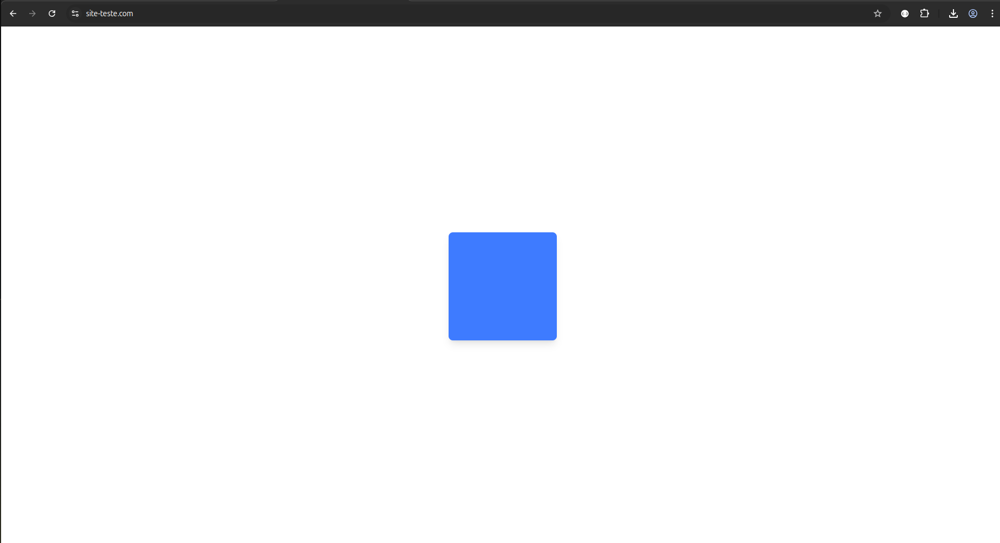

# 🎮 Projeto Remote Control

Aplicação web que exibe um quadrado na tela que pode ser controlado remotamente via um app Android usando protocolo UDP.

### Tela do quadrado da WEB

## Clique na imagem abaixo para testar a versão online

[](https://site-teste.com)

## ⚠️ Status Atual

**Nota importante**: A demonstração ao vivo pode estar indisponível devido aos custos de hospedagem do servidor. Você pode executar localmente seguindo as instruções abaixo.

## 💻 Instalação e Execução Local

Siga estes passos para configurar o projeto no seu computador:

### Pré-requisitos

- Node.js 18.x ou superior
- npm 9.x ou superior
- Git instalado
- Dispositivo Android na mesma rede (para controle) ou emulador

### 1. Clonar o repositório

```bash
git clone https://github.com/MaiconMJS/remote-controle.git
cd remote-control
npm install
npm run dev
```

## ✨ Funcionalidades

- Controle em tempo real do movimento do quadrado (up, down, left, right, stop)
- Comunicação via WebSocket para atualizações instantâneas
- Servidor UDP para conexão com app Android
- Design responsivo com Tailwind CSS
- Endpoint de status da API
- Testes automatizados

## 🛠️ Tecnologias

- **Frontend**: Next.js, TypeScript, Tailwind CSS
- **Backend**: Next.js API
- **Redes**: WebSocket, UDP
- **Testes**: Jest, Axios
- **Gerenciamento de Estado**: React Hooks
